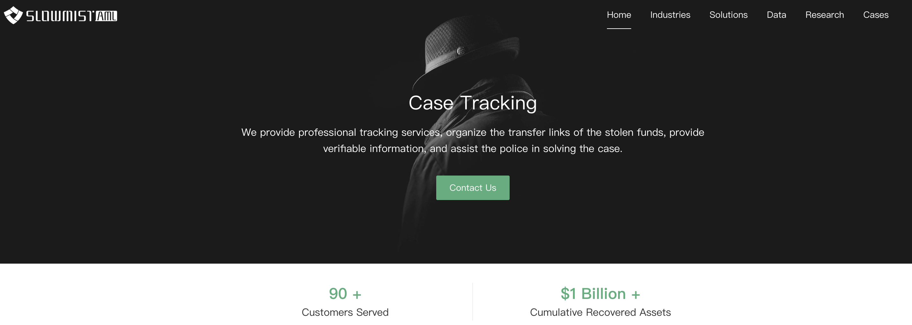

# 资产异常监控及追踪解决方案

## 简介
在做好加密资产安全存管系列措施后，为了应对诸如“黑天鹅”之类的意外情况，也需要对相关钱包地址进行监控及异常告警，让每一笔资产转移都能被内部团队确认、验证。

这篇文章我们将展开讲下资产异常监控及追踪的解决方案，主要有以下三部分：

* 异常监控及告警
* 链上追踪
* 链下追踪

## 异常监控及告警

要对区块链上的钱包地址余额或交易进行监控，可以通过搭建公链全节点的方式，也可以使用第三方提供的数据订阅服务。

监控的逻辑可以根据余额变动来监控，也可以是按交易粒度监控，对目标钱包地址的每一笔链上交易发送提醒。

个人需求可以通过区块浏览器（如 Etherscan）来监控钱包地址，同时满足监控及定制告警的功能（如上图）。除此之外，也可以借助支持导入“观察钱包”的钱包 App（不需要导入私钥助记词，只填写钱包地址），通过 App 的通知功能来实现监控告警功能。

团队需求建议寻找技术工程师，搭建基于消息队列的监控系统及定制化的告警系统（如邮件、Slack、企业微信等消息推送通道），这样系统的稳定性及可用性更有保障。

### 推荐的监控系统

#### MistEye
慢雾团队基于多年链上审计及分析经验沉淀出来的链上监控系统，包括恶意/攻击交易识别、合约监控、转账监控、市场价格监控等，详情请看慢雾官网介绍。

## 链上追踪

如果监控发现钱包地址出现“未授权”的资金转出，可能是遭遇了盗币攻击。可以初步通过区块浏览器确认资金转移路径，对资金留存地址进行监控告警，如果发现转移到中心化交易所，可以联系对应的交易所，提供相关钱包地址、交易 hash 查询。

此外，也可以联系慢雾科技寻求帮助，慢雾 MistTrack 链上追踪服务累计服务 50+ 客户，累计追回资产超 2 亿美金。

依托慢雾 BTI 系统和 AML 系统中近两亿地址标签，全面覆盖了全球主流交易所，当被盗资金流入交易所时，慢雾 MistTrack 系统将自动发送交易 hash 和交易所地址等信息给受害者。同时，慢雾 MistTrack 团队将汇总输出被盗资金转移完整链路表、余额停留地址以及洗币情况总结等信息，输出完整、全面的分析报告给受害者。

被盗案件立案成功后，慢雾 MistTrack 团队将协助警方联系被盗资金进入的可调证交易所，对涉案的交易所账号进行调证冻结。

慢雾 MistTrack 链上追踪服务介绍：
https://aml.slowmist.com/mistTrack.html

## 链下追踪

链下追踪主要指的是与区块链无关的信息，例如邮箱账号、IP地址、设备指纹等信息，根据链上追踪得到这些线索后，可以进一步利用相关平台对链下的信息进行分析取证，寻找一切与盗币者有关的信息。

链下追踪主要是使用“社会工程学”与搜索引擎技术，在互联网海量数据中寻找有关联的信息。
