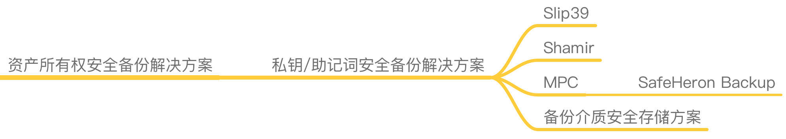

# 资产所有权备份安全 解决方案

## 简介
加密资产所有权备份，即对私钥或助记词的备份，因为它们承载着对加密货币的完整所有权，一旦被盗或丢失则会损失所有资产。

对于加密资产领域来说，私钥/助记词的备份反而是很大的短板，资产使用上的场景都可以有大量对应的产品来解决，无论是热钱包还是冷钱包，使用上可以保证安全，但很容易忽略其备份的重要性。目前大多数的盗币或者丢币的情况，反而是因为私钥/助记词的备份泄漏或丢失而导致的。备份的重要性等同于加密资产本身，必须要重视起来。

私钥/助记词的备份上也可以考虑降低单点风险，并且使用一些安全的备份方式、介质或流程等。以下是推荐的加密资产所有权备份方案。

## Shamir
Shamir秘密共享机制将秘密拆分后分发给一群人。在这个算法中，原始秘密以适当的方式被拆分成n部分，并将拆分后的每一部分分发给不同的参与者。算法的配置决定了最终需要多少个参与者协作才能恢复原始秘密。当使用Shamir秘密共享机制保护大容量数据时，一般将对称密钥拆分并进行分布式存储，而非直接针对数据运用Shamir算法，这是因为待拆分的秘密容量必须小于秘密共享算法所使用的某些数据。这个算法的UNIX/Linux版本被称为ssss，其他操作系统或编程语言也有相似的应用和开发库。

以上内容节选自《零信任网络：在不可信网络中构建安全系统》 

当前比较优秀的基于Shamir进行私钥备份分享的有：

### Trezor SHAMIR BACKUP
This new security standard, Shamir Backup, counteracts the two greatest risks involved with protecting your recovery seed: theft and destruction.

详细介绍：https://trezor.io/shamir

配合Trezor硬件钱包使用是一个不错的安全备份方式。

### 通用私钥备份及还原程序 by SlowMist (to be done)
慢雾团队基于Shamir算法结合自身的安全经验研发了一套私钥分片及备份恢复的程序，整理后未来会进行开源，敬请期待。

## MPC
使用MPC（安全多方计算）可以在最初的私钥生成时即可分为多个分片，将不同的分片分发给一群人，需要恢复时使用特定的程序来还原出原始私钥即可，也是一种优秀的解决单点备份问题的机制。

### SafeHeron Backup (to be done)
安全鹭（SafeHeron）提供了一套基于MPC的备份还原程序，即将开源。

## 备份介质安全存储方案
无论是抄写的助记词，存储的keystore文件，还是已经分隔后的私钥分片，也需要安全的存储，需要考虑持久性及安全性，保证完全的断网及物理隔离，或完善的加密存储机制。

### 介质安全
推荐使用金属材质的介质来保存抄写的助记词，或者保证手抄的纸张等结实耐用，如imKey的"金钢版助记词密盒"：
采用 304 不锈钢材质，防水、防火、耐腐蚀，支持 2 套助记词保管。
更多详细介绍见imKey官网：https://imkey.im

### 存储环境安全
将备份的内容介质存放在安全可靠的环境中，如高规格的保险箱等，同时确保其隐蔽性。

### 离线加密存储
如果存储在电脑或其它电子设备中，需要加密存储，如使用GPG等加密工具进行加密，并且将加解密使用的密钥分开存放在其它位置，而不是同一台电脑或设备中。

同时需要考虑断网离线，降低被远程攻击的可能性。
