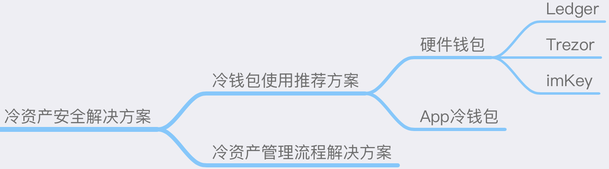

# 冷资产安全解决方案

## 简介
加密世界的冷资产主要是指不会经常进行交易的大额资产，并且私钥保存在断网隔离的状态下。理论上来讲冷资产越"冷"越好，即私钥保证永不触网，并且尽量少的交易，尽量避免暴露地址信息等。安全上的方案建议一方面是私钥存储的安全性，做到尽可能的"冷"；另一方面是使用上的管理流程，尽可能避免私钥泄漏、不在预期内的转账或其它未知的行为。

## 冷钱包使用推荐方案
当前冷钱包大体上分为硬件钱包和App冷钱包两类。

### 硬件钱包
顾名思义，即使用单独的硬件来存储私钥，通过蓝牙或有线与App、网页等连接来实现签名数据的传输。市面上常见的硬件钱包有以下几种推荐：

#### Ledger
Ledger是行业知名硬件钱包，为加密资产提供高级别的安全性，产品结合了安全元件和专为保护资产而设计的专有操作系统。

官网：https://www.ledger.com

#### Trezor
Trezor 也是区块链行业比较知名的硬件钱包，代码开源。一个亮点是其推荐的Shamir备份方案：

https://trezor.io/shamir

并且Trezor Model T已经支持这种安全的备份模式，值得尝试。

官网：https://trezor.io

#### imKey
imKey 是一款内置CC EAL 6+ 安全芯片 · 超薄机身 · 蓝牙连接 · 与 imToken 深度集成的硬件钱包，目前支持 BTC、ETH、COSMOS 、EOS 等 imToken 2.0 支持的所有数字资产，未来将会通过升级支持更多的数字资产。

官网：https://imkey.im

#### Keystone
Keystone 是一款全开源的Air-Gap硬件钱包，为了进一步增强安全性，Keystone3 Pro配备了来自三套不同厂商安全芯片（Secure Elements），并支持在一台设备上贮存多套助记词。

是目前唯一一款与MetaMask（插件与移动端）均进行了整合的硬件钱包。

官网：https://keyst.one

#### OneKey
OneKey 是一款有安全芯片且全开源的硬件钱包品牌，其拥有支持手机端、浏览器插件、桌面客户端的完整生态，已经支持40+公链且原生支持几乎所有 EVM 链。
官网：https://onekey.so

### App冷钱包

#### imToken冷钱包
imToken冷钱包是指手机在断网的情况下使用imToken，并且进行离线签名的场景，详细使用方式见以下文章：

[如何设置 imToken 冷钱包？](https://support.token.im/hc/zh-cn/articles/360003147833)

## 冷资产管理流程解决方案
由于冷资产的价值相对较大，属于黑客重点攻击的对象，金钱的诱惑也容易催生出内部作案的可能。如果是一个公司或组织的共有资产，推荐使用一套完善的使用流程来规避被攻击和单点做恶的风险，并且做好流程中每一步的日志记录，以备安全审查。

### 完善的审批流程
可以在公司内部使用一套成熟的财务审批系统，或者自研的系统，从转账发起到最后转账执行形成流程，需要多方参与审批后才能执行签名转账或其它行为。

### 多方监督的使用流程
如将存储私钥的硬件钱包放置在保险柜中，在审批完成后，由财务在监督者监督的情形下使用硬件钱包进行转账。

### 资产交易监控
对冷资产的交易进行监控，任何人可以随时提出异议，监控方式可参考：

 [资产异常监控及追踪解决方案](Asset-Abnormal-Monitoring-And-Tracking-Solution.md)
