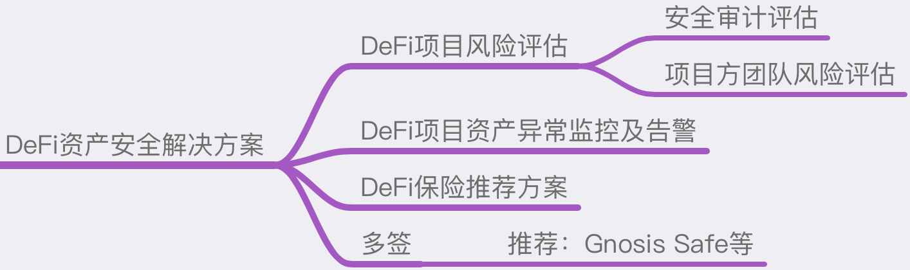

# DeFi资产安全解决方案
## 简介
当前大多数区块链参与方更多的是参与DeFi项目，如挖矿、借贷及理财等。而参与DeFi项目本质上是把手中的资产转移或授权给DeFi项目方，存在个人极大程度上不可控的安全风险。
本方案旨在列出DeFi项目的风险点，并且整理出规避这些风险的方式，总体上可分为以下几个方面。



## 【前】DeFi项目风险评估
### 识别：
1. 项目方团队背景；
2. 项目方历史项目的安全性；
3. 项目方掌握的权限。

### 评估：
1. 项目是否有第三方知名审计机构审计；
2. 项目的运行时间是否足够长（如运行3个月以上未发生安全事故的）；
3. 项目的代码质量是否优质；
4. 项目代码是否是透明开源的；
5. 项目方的权限管理是否公开透明；
6. 项目管理的资金规模是否较大；
7. 项目方是否获得知名 VCs（风险投资机构） 投资；
8. 项目社区用户是否活跃，参与的用户数量是否够多。

### 处置：
1. 仅参与经过(推荐多家)知名安全团队审计过的项目；
2. 仅参与项目代码已开源的项目；
3. 尽量选择参与运行时间长的项目；
4. 尽量选择参与由社区治理的项目；
5. 尽量选择参与项目已经获得多家风险投资机构投资的项目；
6. 为已经参与的项目购买保险。

## 【中】DeFi 项目资产异常监控及告警
### 项目异常的情报捕获：
1. 媒体快讯（国内外的平台，如：推特）；
2. 社区消息（如：慢雾区）；
3. 预警平台告警 （如：RugDoc）；
4. 项目的资产发生异动。

### 应对措施：
1. 及时取出资产。

## 【中】多签合约的使用
### 钱包使用风险：
在使用钱包参与DeFi项目的时候，由于需要频繁使用钱包与DeFi进行交互，在这样的场景下可能由于各种问题导致私钥泄露，有资产被盗的风险。

使用硬件钱包参与DeFi项目又会因为使用的频率较高，与硬件钱包的交互会太繁琐，所以为了同时满足安全与便捷，建议使用多签合约参与DeFi项目。

### 多签合约推荐：
多签合约可以使用 gnosis-safe 的多签方案快速生成一个多签钱包(如：2/3)，避免由于单一钱包的私钥泄露导致的资产被盗。

网址：https://gnosis-safe.io/

## 【后】DeFi 保险推荐方案
可以根据已参加的 DeFi 项目挑选合适的知名保险项目投保，保险项目参考如下链接：
https://debank.com/projects?tag=insurance
