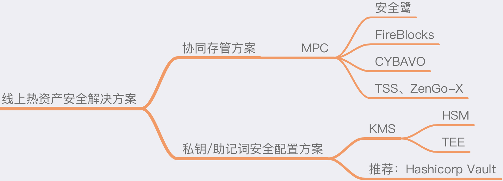

# 线上热资产安全解决方案

## 简介
线上热资产主要是指加密货币私钥放置在线上服务器中对应的资产，需要频繁使用来进行签名交易等，如交易所的热、温钱包等都属于线上热资产。这类资产由于放置在线上服务器中，被黑客攻击的可能性大大增加，是需要重点防护的资产。由于私钥的重要性，提高安全存储等级（如硬件加密芯片保护）、去除单点风险等都是防范攻击的重要手段。本文推荐以下两个方向来提升线上热资产的安全性。

## 协同存管方案
此方案旨在解决线上私钥的单点存储及使用的风险。在以前的方案中，解决私钥单点问题主要通过使用多签，而随着区块链的快速发展，链的种类越来越多，传统的多签（如比特币的多签及以太坊的智能合约多签等）无法适用于所有链的多签方式，导致为了不同的链需要开发不同的多签方案，安全流程极其繁琐和不可控；尤其是线上的热资产本身的场景就需要适应多种链及币种，如交易所、量化等场景。

能兼容所有区块链及币种的通用多签方案是最好的方式，而目前最成熟的解决方案是 MPC（安全多方计算）。

### 关于 MPC 的解释
安全多方计算（英文：Secure Multi-Party Computation）的研究主要是针对无可信第三方的情况下，如何安全地计算一个约定函数的问题。安全多方计算是电子投票、门限签名以及网上拍卖等诸多应用得以实施的密码学基础。

安全多方计算起源于1982年姚期智的百万富翁问题，后来 Oded Goldreich 有比较细致系统的论述。

当前 MPC 对区块链的支持需要在算法层面做很多的研究，对科研及算法底层的要求极高，所以推荐使用开源的程序及已有的商业解决方案，主要推荐如下：

### 通用多签解决方案
#### 安全鹭（Safeheron）
安全鹭（Safeheron）是领先的数字资产安全存管解决方案提供商。安全鹭（Safeheron）以绝对领先的加密技术， 在确保客户完全掌握自己数字资产的前提下， 提供安全高效的存管服务及解决方案。

官网：https://www.safeheron.com

#### FireBlocks
Fireblocks is an all-in-one platform to store, transfer, and issue digital assets across your entire ecosystem.

Fireblocks是全球较早的提供基于MPC技术提供加密货币协同存管方案的服务商。

官网：https://www.fireblocks.com

#### CYBAVO
面向未来的银行级加密货币管理解决方案。

官网：https://www.cybavo.com/zh-cn

#### TSS 开源库
This is an implementation of multi-party {t,n}-threshold ECDSA (Elliptic Curve Digital Signature Algorithm) based on Gennaro and Goldfeder CCS 2018 1 and EdDSA (Edwards-curve Digital Signature Algorithm) following a similar approach.
TSS是币安开源的门限签名的库，目前支持的算法有ECDSA及EdDSA，开发语言为Go。

开源仓库地址：https://github.com/binance-chain/tss-lib

#### ZenGo-X multi-party-ecdsa 开源库
Rust implementation of {t,n}-threshold ECDSA (elliptic curve digital signature algorithm).
multi-party-ecdsa是MPC钱包方ZenGo提供的开源门限签名的库，支持ECDSA，开发语言为Rust。

开源仓库地址：https://github.com/ZenGo-X/multi-party-ecdsa

## 私钥/助记词安全配置方案
在无法使用 MPC 方案的情况下，如一些小型的加密货币服务、或项目已经成熟变更周期长时，可以针对已有的私钥、助记词等存储及使用进行加强处理，目前的安全建议如下：

### KMS
KMS（Key Management Service），即私钥管理服务。当下有很多云服务平台提供相关的KMS产品，主要的安全建议是要尽可能使用硬件级方案来对私钥进行管理，尽可能确保私钥在服务器上、数据库里、内存中等地方不会明文暴露，并且使用上有完整的流程及日志记录。

硬件方面上，可以使用HSM或TEE来提升KMS服务的安全级别：
#### HSM
HSM（Hardware security module），即硬件安全模块，是一种用于保障和管理强认证系统所使用的数字密钥，并同时提供相关密码学操作的计算机硬件设备。

目前各大云服务平台都有提供，可以在自己使用的云服务平台上进行搜索了解。

#### TEE
TEE（Trusted Execution Environment），即可信执行环境，是中央处理器中安全的区域，可以保证其中的程式和资料在机密性和完整性上得到保护。TEE是隔离的执行环境，可以有安全的机能，例如隔离执行、和TEE一起执行的应用程序完整性，也包括其资产的机密性。用一般的术语来说，TEE提供安全性更高的执行空间，给可信软件执行，其安全性比操作系统（OS）更强，机能性比安全元件（secure element）更多。

目前芯片厂商及云服务平台都有提供，如微软云及AWS等。

### Hashicorp Vault
##### Manage Secrets and Protect Sensitive Data
Secure, store and tightly control access to tokens, passwords, certificates, encryption keys for protecting secrets and other sensitive data using a UI, CLI, or HTTP API.
Hashicorp Vault是一种安全管理机密信息的工具，包括开源软件及商业服务。它可以使用Shamir分享算法来进行分片管理，通过多方参与才能启动服务，是比较好的杜绝单点隐患的方式。同时商业版本也可以支持HSM。

官网：https://www.vaultproject.io

开源仓库地址：https://github.com/hashicorp/vault

---
### 参考文献
[安全多方计算](https://zh.wikipedia.org/wiki/%E5%AE%89%E5%85%A8%E5%A4%9A%E6%96%B9%E8%AE%A1%E7%AE%97)

[Secure multi-party computation (MPC) 介绍](https://zhuanlan.zhihu.com/p/100648606)

[HSM 硬件安全模块](https://zh.wikipedia.org/wiki/%E7%A1%AC%E4%BB%B6%E5%AE%89%E5%85%A8%E6%A8%A1%E5%9D%97)

[可信执行环境](https://zh.wikipedia.org/zh-cn/%E5%8F%AF%E4%BF%A1%E6%89%A7%E8%A1%8C%E7%8E%AF%E5%A2%83)
