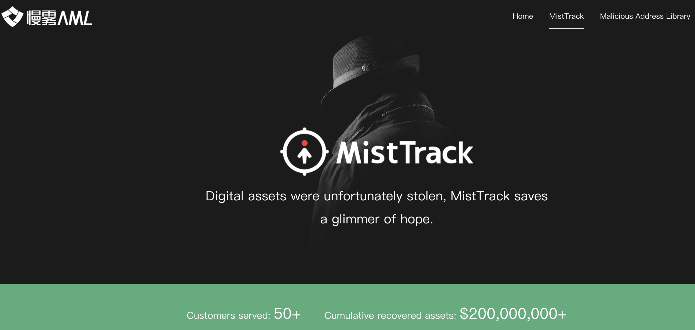

# Asset Abnormal Monitoring And Tracking Solution

## Summary
After implementing a series of measures for the safe custody of encrypted assets, in order to deal with unexpected situations such as "black swan", it is also necessary to monitor the relevant wallet addresses and abnormal alarms, so that every asset transfer can be confirmed by the internal team. verify.

In this article, we will start to talk about the solution of asset abnormality monitoring and tracking, which mainly has the following three parts:

* Abnormal Monitoring And Alerting
* Tracking On The Blockchain
* Tracking Under The Blockchain

## Abnormal Monitoring And Alerting

To monitor the wallet address balance or transaction on the blockchain, you can build a full node on the public chain, or you can use a data subscription service provided by a third party.

The monitoring logic can be monitored according to balance changes, or according to transaction granularity, sending reminders for each on-chain transaction of the target wallet address.

Personal needs can monitor the wallet address through a block explorer (such as Etherscan), and at the same time meet the monitoring and customized alarm functions (as shown above). In addition, you can also use the wallet App that supports the import of "watch wallet" (no need to import the private key mnemonic, just fill in the wallet address), through the notification function of the App to realize the monitoring alarm function.

The team’s needs are recommended to find technical engineers to build a monitoring system based on message queues and a customized alarm system (such as mail, Slack, corporate WeChat and other message push channels), so that the stability and availability of the system are more guaranteed.

### Recommended Monitoring System

#### MistEye
The on-chain monitoring system developed by the SlowMist team based on years of on-chain auditing and analysis experience includes malicious/attack transaction identification, contract monitoring, transfer monitoring, market price monitoring, etc. For details, please see the SlowMist official website.

## Tracking On The Blockchain

If the monitoring finds "unauthorized" fund transfers from the wallet address, it may be due to a currency theft attack. You can preliminarily confirm the fund transfer path through the blockchain browser, and monitor and alert the fund retention address. If you find that it is transferred to a centralized exchange, you can contact the corresponding exchange to provide related wallet addresses and transaction hash queries.

In addition, you can also contact SlowMist Technology for help. SlowMist's MistTrack on-chain tracking service has served 90+ customers and recovered more than 1 billion US dollars in assets.

Relying on more than 300 million address tags in the SlowMist BTI system and AML system, it fully covers mainstream exchanges around the world. When the stolen assets flow into the exchange, the SlowMist MistTrack system will automatically send information such as the transaction hash and exchange address to the victim. At the same time, the SlowMist MistTrack team will summarize and output the complete link list of stolen assets transfer, the balance staying address, and the summary of coin laundering, and output a complete and comprehensive analysis report to the victim.

After the successful filing of the theft case, the SlowMist MistTrack team will assist the police in contacting the adjustable stock exchange where the stolen assets entered, and freeze the account of the exchange involved.

SlowMist MistTrack on-chain tracking service introduction:
https://aml.slowmist.com/mistTrack.html

## Tracking Under The Blockchain
Off-chain tracking mainly refers to information that has nothing to do with the blockchain, such as email account numbers, IP addresses, device fingerprints and other information. After these clues are obtained based on the on-chain tracking, the relevant platforms can be further used to analyze and collect evidence on off-chain information. Look for all the information related to the thief.

Off-chain tracking mainly uses "social engineering" and search engine technology to find relevant information in the massive data of the Internet.
