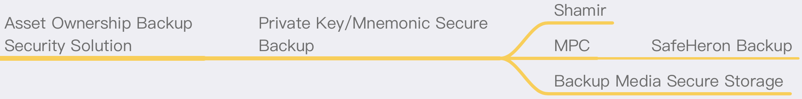

# Asset Ownership Backup Security Solution

## Summary
Asset ownership backup in the crypto world, that is, the backup of private keys or mnemonic, because they carry the complete ownership of the encrypted currency, once they are stolen or lost, all assets will be lost.

For the field of crypto assets, the backup of private keys/mnemonic is a big shortcoming. Asset usage scenarios can be solved by a large number of corresponding products. Whether it is a hot wallet or a cold wallet, the use can be guaranteed safe, but it is easy to overlook the importance of its backup. At present, most of the theft or loss of coins is caused by the leakage or loss of the backup of the private key/mnemonic. The importance of backup is the same as the crypto asset itself, and it must be taken seriously.

For the backup of private keys/mnemonics, you can also consider reducing single points of risk, and use some secure backup methods, media, or processes. The following is a recommended backup solution for the ownership of crypto assets.

## Slip39
Enhanced 20-word backup standard ensures a more robust process for backing up and recovering your wallet compared to the legacy standard. With an upgraded, user-friendly wordlist and seamless transition to Multi-share Backup, SLIP39 offers superior security with no single point of failure. Technically, it is based on Shamir's algorithm, forming a more generalized standard for cryptocurrency mnemonic phrases.

Detailed introduction: https://content.trezor.io/slip39

## Shamir
The Shamir secret sharing mechanism splits the secret and distributes it to a group of people. In this algorithm, the original secret is split into n parts in an appropriate way, and each part after splitting is distributed to different participants. The configuration of the algorithm determines how many participants are ultimately required to cooperate to recover the original secret. When using the Shamir secret sharing mechanism to protect large-capacity data, the symmetric key is generally split and stored in a distributed manner, instead of directly applying the Shamir algorithm to the data. This is because the capacity of the secret to be split must be smaller than that used by the secret sharing algorithm some of the data. The UNIX/Linux version of this algorithm is called ssss, and other operating systems or programming languages have similar applications and development libraries.

The above content is excerpted from "Zero Trust Network: Building a Security System in an Untrusted Network"

The current excellent private key backup sharing based on Shamir are:

### Trezor SHAMIR BACKUP
This new security standard, Shamir Backup, counteracts the two greatest risks involved with protecting your recovery seed: theft and destruction.

Detailed introduction: https://trezor.io/shamir

Use with Trezor hardware wallet is a good safe backup method.

### Universal private key backup and restore program by SlowMist (to be done)
The SlowMist team has developed a set of private key slicing and backup and recovery procedures based on the Shamir algorithm and its own security experience. After finishing, it will be open sourced in the future.

## MPC
Using MPC (Secure Multi-Party Computing) can be divided into multiple shards when the initial private key is generated, and different shards can be distributed to a group of people. When recovery is needed, use a specific program to restore the original private key. It is also an excellent mechanism to solve the single point backup problem.

### SafeHeron Backup (to be done)
SafeHeron provides a set of MPC-based backup and restore programs, which will be open source soon.

## Backup media secure storage solution
Whether it is copied mnemonics, stored keystore files, or separated private key fragments, secure storage is also required. Persistence and security need to be considered to ensure complete disconnection and physical isolation, or perfect encryption storage mechanism.

### Media security
It is recommended to use metal media to store the copied mnemonic, or to ensure that the handwritten paper is strong and durable, such as imKey's "Golden Steel Version Mnemonic Secret Box":
It is made of 304 stainless steel, waterproof, fireproof, and corrosion-resistant, and supports 2 sets of mnemonic storage.
For more detailed introduction, please refer to imKey official website: https://imkey.im

### Storage environment security
Store the backup content media in a safe and reliable environment, such as a high-standard strongbox/safe house, etc., while ensuring its concealment.

### Offline encrypted storage
If it is stored in a computer or other electronic device, it needs to be stored encrypted, such as using encryption tools such as GPG for encryption, and the keys used for encryption and decryption are stored separately in other locations, rather than in the same computer or device.

At the same time, you need to consider disconnection and offline to reduce the possibility of remote attacks.
