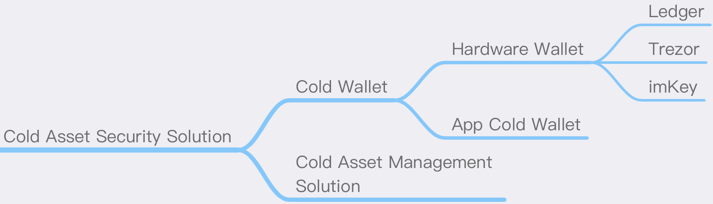

# Cold Asset Security Solution

## Summary
The cold assets in the crypto world mainly refer to large assets that are not frequently traded, and the private keys are kept in a disconnected state. In theory, the colder the asset is, the "cold" the better, that is, the private key is guaranteed to never touch the Internet, and there are as few transactions as possible to avoid exposing address information. On the one hand, the security proposal is to store the private key as "cold" as possible; on the other hand, it is to use the management process to avoid private key leakage, unexpected transfers or other unknown behaviors as much as possible.

## Cold Wallet
The current cold wallets are roughly divided into hardware wallets and App cold wallets.

### Hardware Wallet
As the name implies, a separate hardware is used to store the private key, and the signature data is transmitted through Bluetooth or wired connection with App, web pages, etc. The common hardware wallets on the market have the following recommendations:

#### Ledger
Ledger is a well-known hardware wallet in the industry that provides a high level of security for encrypted assets. The product combines secure components and a proprietary operating system designed to protect assets.

Official website: https://www.ledger.com

#### Trezor
Trezor is also a well-known hardware wallet in the blockchain industry with open source code. One highlight is its recommended Shamir backup solution:

https://trezor.io/shamir

And Trezor Model T already supports this safe backup mode, which is worth trying.

Official website: https://trezor.io

#### imKey
imKey is a hardware wallet with built-in CC EAL 6+ security chip, ultra-thin body, Bluetooth connection, and deep integration with imToken. It currently supports all digital assets supported by imToken 2.0 such as BTC, ETH, COSMOS, EOS, etc. It will be upgraded in the future to support more digital assets.

Official website: https://imkey.im

#### Keystone
Keystone is an open-source airgap hardware wallet that utilizes an embedded system. The device is equipped with three secure element chips. One of Keystone’s unique features is to support multiple recovery seed phrases.

Keystone is currently the only hardware wallet that is compatible with both MetaMask desktop and mobile versions.

Official website: https://keyst.one

### App Cold Wallet

#### imToken Cold Wallet
The imToken cold wallet refers to the scenario where the mobile phone uses imToken and performs offline signatures when the mobile phone is disconnected from the network. For detailed usage, please refer to the following article:

[How do I use cold wallet (formerly: watch wallet)？](https://support.token.im/hc/en-us/articles/360003147833)

## Cold Asset Management Solution
Since the value of cold assets is relatively large, they are the key targets of hackers, and the temptation of money can easily give rise to the possibility of internal crimes. If it is a common asset of a company or organization, it is recommended to use a complete set of usage procedures to avoid the risk of being attacked and single-point evil, and to make a log record of each step in the process for security review.

### Perfect approval process
A mature financial approval system or a self-developed system can be used within the company to form a process from the initiation of the transfer to the final execution of the transfer. It requires multiple parties to participate in the approval before the signature transfer or other actions can be performed.

### Multi-party supervised use process
For example, the hardware wallet that stores the private key is placed in a safe, and after the approval is completed, the finance will use the hardware wallet to transfer assets under the supervision of the supervisor.

### Asset transaction monitoring
To monitor the transaction of cold assets, anyone can raise an objection at any time. The monitoring method can refer to:

 [Asset Abnormal Monitoring And Tracking Solution](Asset-Abnormal-Monitoring-And-Tracking-Solution.md)
