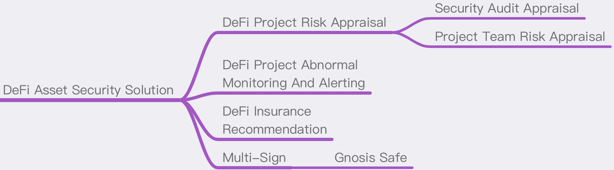

# DeFi Asset Security Solution
## Summary
At present, most blockchain participants are more involved in DeFi projects, such as mining, lending and financial management. Participating in a DeFi project is essentially the transfer or authorization of assets in the hand to the DeFi project party, and there is a security risk that is largely uncontrollable by individuals.
This solution aims to list the risk points of the DeFi project and sort out the ways to avoid these risks. Generally speaking, it can be divided into the following aspects.



## [Previous] DeFi Project Risk Assessment
### Identify:
1. Project team background;
2. The safety of the historical project of the project party;
3. The authority controlled by the project party.

### Evaluate:
1. Whether the project is audited by a well-known third-party audit team;
2. Whether the operation time of the project is long enough (for example, no safety accident occurred during operation for more than 3 months);
3. Whether the code quality of the project is high quality;
4. Whether the project code is transparent and open source;
5. Whether the authority management of the project party is open and transparent;
6. Whether the scale of project management assets is large;
7. Whether the project party has obtained investment from well-known VCs (venture investment institutions);
8. Whether the project community users are active and whether the number of participating users is large enough.

### Handle:
1. Only participate in projects that have been audited by (recommended multiple) well-known security teams;
2. Only participate in projects whose project code has been open source;
3. Try to choose projects that have a long running time;
4. Try to choose to participate in projects governed by the community;
5. Try to choose projects that have been invested by multiple venture capital institutions to participate in the project;
6. Purchase insurance for the projects you have participated in.

## [Participating] DeFi project asset abnormal monitoring and alerting
### Intelligence capture of project anomalies:
1. Media news (platforms at home and abroad, such as Twitter);
2. Community news (eg: SlowMist Zone https://slowmist.io/en );
3. Early warning platform alarm (such as RugDoc);
4. The assets of the project are changed.

### Handle：
1. Take out assets in time.

## [Participating] Use of multi-signature smart contracts
### Risks of using wallet:
When using a wallet to participate in a DeFi project, due to the need to frequently use the wallet to interact with DeFi, in such a scenario, the private key may be leaked due to various problems, and there is a risk of asset theft.

Using hardware wallets to participate in DeFi projects will be too cumbersome to interact with hardware wallets because of the high frequency of use. Therefore, in order to meet safety and convenience at the same time, it is recommended to use multi-signature smart contracts to participate in DeFi projects.

### Multi-sign smart contract recommendation:
Multi-signature contracts can use gnosis-safe's multi-signature solution to quickly generate a multi-signature wallet (for example, 2/3 or more parties participate) to avoid asset theft due to the leakage of the private key of a single wallet.

Official website：https://gnosis-safe.io

## [After] DeFi Insurance Recommended Plan
You can select suitable well-known insurance projects to insure according to the DeFi projects you have participated in. For insurance projects, refer to the following link: 

https://debank.com/projects?tag=insurance
