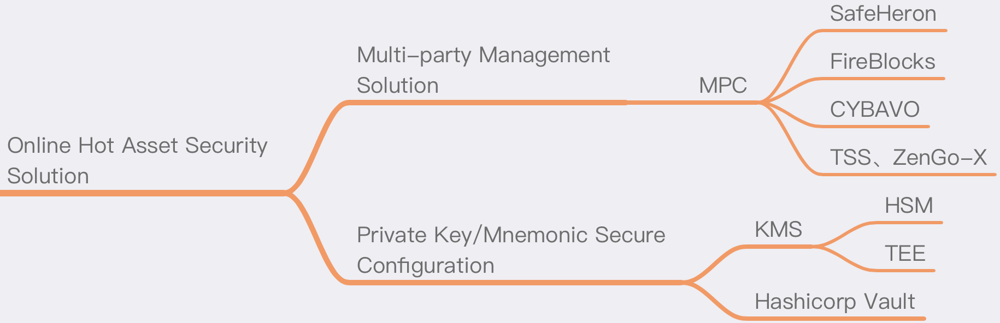

# Online Hot Asset Security Solution

## Summary
Online hot assets mainly refer to the assets corresponding to the cryptocurrency private keys placed in online servers, which need to be used frequently for signature transactions, etc., such as hot wallets and warm wallets of exchanges are all online hot assets. Because these assets are placed on online servers, the possibility of being attacked by hackers is greatly increased, and they are assets that require key protection. Due to the importance of private keys, improving the level of secure storage (such as hardware encryption chip protection) and removing single points of risk are important means to prevent attacks. This article recommends the following two directions to improve the security of online thermal assets.

## Multi-party Management Solution
This solution aims to solve the risk of single-point storage and use of online private keys. In the previous solution, the single-point problem of private keys was mainly solved by using multi-signature. With the rapid development of blockchain, there are more and more types of chains. Traditional multi-signature (such as Bitcoin's multi-signature and Ethereum smart contract multi-signature, etc.) cannot be applied to the multi-signature method of all chains, which leads to the need to develop different multi-signature schemes for different chains. The security process is extremely cumbersome and uncontrollable; especially the online hot assets themselves need to be adapt to multiple chains and currencies, such as exchanges, quantification and other scenarios.

A universal multi-signature solution compatible with all blockchains and currencies is the best way, and the most mature solution currently is MPC (Secure Multi-Party Computation).

### What is MPC
The research of secure multi-party computing is mainly aimed at the problem of how to safely calculate an agreed function without a trusted third party. Secure multi-party computing is the cryptographic basis for the implementation of many applications such as electronic voting, threshold signatures, and online auctions.

Secure multi-party computing originated from Yao Qizhi's millionaire problem in 1982, and later Oded Goldreich made a more detailed and systematic discussion.

At present, MPC's support for blockchain requires a lot of research at the algorithm level, which has extremely high requirements for scientific research and the underlying algorithm. Therefore, it is recommended to use open source programs and existing commercial solutions. The main recommendations are as follows:

### Universal multi-signature solution
#### SafeHeron
SafeHeron is a leading provider of digital asset safe custody solutions. With absolute leading encryption technology, SafeHeron provides safe and efficient depository services and solutions on the premise of ensuring that customers have complete control of their digital assets.

Official website: https://www.safeheron.com

#### FireBlocks
FireBlocks is an all-in-one platform to store, transfer, and issue digital assets across your entire ecosystem.

FireBlocks is one of the earliest service providers in the world to provide collaborative cryptocurrency depository solutions based on MPC technology.

Official website: https://www.fireblocks.com

#### TSS open source library
This is an implementation of multi-party {t,n}-threshold ECDSA (Elliptic Curve Digital Signature Algorithm) based on Gennaro and Goldfeder CCS 2018 1 and EdDSA (Edwards-curve Digital Signature Algorithm) following a similar approach.

GitHub repository: https://github.com/binance-chain/tss-lib

#### ZenGo-X multi-party-ecdsa open source library
Rust implementation of {t,n}-threshold ECDSA (elliptic curve digital signature algorithm).

GitHub repository: https://github.com/ZenGo-X/multi-party-ecdsa

## Private Key/Mnemonic Secure Configuration
In the case that the MPC solution cannot be used, such as some small cryptocurrency services, or when the project has matured and the change cycle is long, the storage and use of existing private keys, mnemonics, etc. can be strengthened. The current security recommendations are as follows :

### KMS
KMS (Key Management Service), that is, private key management service. Currently, there are many cloud service platforms that provide related KMS products. The main security recommendation is to use hardware-level solutions to manage private keys as much as possible, and ensure that private keys are not exposed in plaintext on the server, database, memory, etc. , And there is a complete process and log record for use.

In terms of hardware, HSM or TEE can be used to improve the security level of KMS services:

#### HSM
HSM (Hardware security module), namely the hardware security module, is a computer hardware device used to protect and manage the digital key used by the strong authentication system and provide related cryptographic operations at the same time.

At present, all major cloud service platforms are provided, and you can search on the cloud service platform you use.

#### TEE
TEE (Trusted Execution Environment) is a secure area in the central processing unit, which can ensure that the programs and data in it are protected in terms of confidentiality and integrity. TEE is an isolated execution environment, which can have secure functions, such as isolated execution, the integrity of applications executed with TEE, and the confidentiality of its assets. In general terms, TEE provides a more secure execution space for trusted software to execute. Its security is stronger than the operating system (OS), and its functionality is more than secure elements.

Currently, chip manufacturers and cloud service platforms provide such services, such as Microsoft Cloud and AWS.

### Hashicorp Vault
##### Manage Secrets and Protect Sensitive Data
Hashicorp Vault is a tool for securely managing confidential information, including open source software and commercial services. It can use the Shamir sharing algorithm to manage the shards, and the service can be started only through the participation of multiple parties, which is a better way to eliminate single-point hidden dangers. At the same time, the commercial version can also support HSM.

Official website: https://www.vaultproject.io

GitHub repository: https://github.com/hashicorp/vault

---
### References
[安全多方计算](https://zh.wikipedia.org/wiki/%E5%AE%89%E5%85%A8%E5%A4%9A%E6%96%B9%E8%AE%A1%E7%AE%97)

[Secure multi-party computation (MPC) 介绍](https://zhuanlan.zhihu.com/p/100648606)

[HSM 硬件安全模块](https://zh.wikipedia.org/wiki/%E7%A1%AC%E4%BB%B6%E5%AE%89%E5%85%A8%E6%A8%A1%E5%9D%97)

[可信执行环境](https://zh.wikipedia.org/zh-cn/%E5%8F%AF%E4%BF%A1%E6%89%A7%E8%A1%8C%E7%8E%AF%E5%A2%83)
