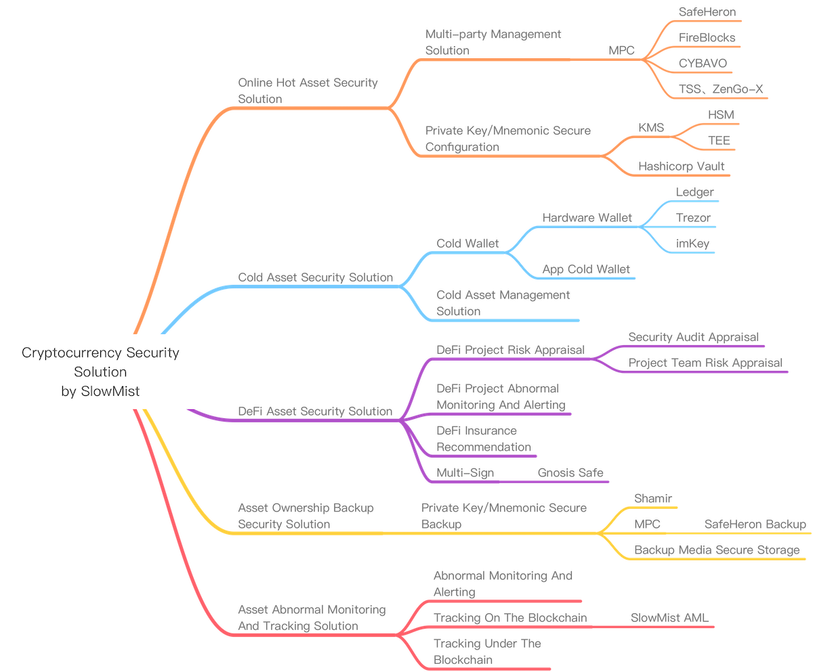

# Cryptocurrency Security Solution by SlowMist

This solution is organized by the SlowMist Security Team and aims to provide a full range of asset security solutions for participants in the crypto world. We divide the security of crypto assets into the following five major parts, and make a detailed interpretation of each part, including various risks and related solutions.

#### [Online Hot Asset Security Solution](Online-Hot-Asset-Security-Solution.md)

#### [Cold Asset Security Solution](Cold-Asset-Security-Solution.md)

#### [DeFi Asset Security Solution](DeFi-Asset-Security-Solution.md)

#### [Asset Ownership Backup Security Solution](Asset-Ownership-Backup-Security-Solution.md)

#### [Asset Abnormal Monitoring And Tracking Solution](Asset-Abnormal-Monitoring-And-Tracking-Solution.md)
