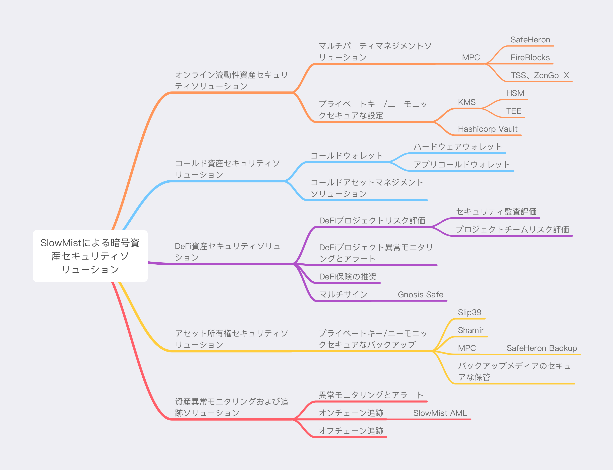
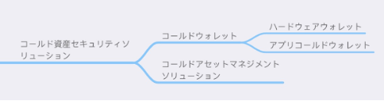
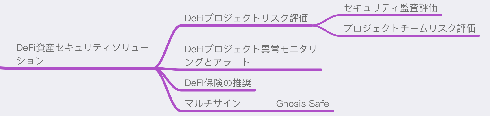
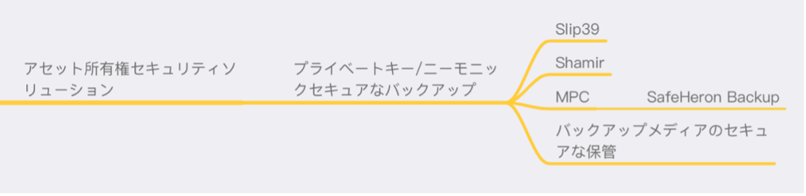
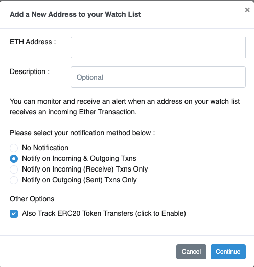
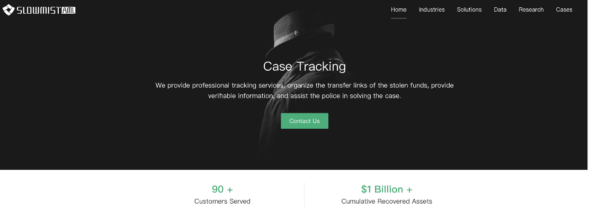

# 暗号資産セキュリティソリューション
日本語版 

翻訳者：
>[Jack Jia](https://x.com/JackJia2021)

:anchor:**Contents**
- [オンライン流動性資産セキュリティソリューション](#オンライン流動性資産セキュリティソリューション)
  - [オンライン流動性資産セキュリティソリューション概要](##オンライン流動性資産セキュリティソリューション概要)
  - [協同保管ソリューション](##協同保管ソリューション)
  - [MPCの説明](##MPCの説明)
  - [参考資料](##参考資料)
- [コールド資産セキュリティソリューション](#コールド資産セキュリティソリューション)
  - [コールド資産セキュリティソリューション概要](##コールド資産セキュリティソリューション概要)
  - [コールド钱包使用推奨ソリューション](##コールド钱包使用推奨ソリューション)
  - [コールド資産管理プロセスソリューション](##コールド資産管理プロセスソリューション)
- [DeFi資産セキュリティソリューション](#DeFi資産セキュリティソリューション)
  - [DeFi 資産セキュリティソリューション概要](##DeFi 資産セキュリティソリューション概要)
  - [DeFiプロジェクトリスク評価](##DeFiプロジェクトリスク評価)
  - [DeFiプロジェクトの資産異常モニタリングおよびアラート](##DeFiプロジェクトの資産異常モニタリングおよびアラート)
  - [マルチシグコントラクトの使用](##マルチシグコントラクトの使用)
- [資産所有権のセキュリティバックアップソリューション](#資産所有権のセキュリティバックアップソリューション)
  - [資産所有権のセキュリティバックアップソリューション概要](##資産所有権のセキュリティバックアップソリューション概要)
  - [バックアップ媒体の安全な保管ソリューション](##バックアップ媒体の安全な保管ソリューション)
- [資産異常モニタリングおよび追跡ソリューション](#資産異常モニタリングおよび追跡ソリューション)
  - [資産異常モニタリングおよび追跡ソリューション概要](##資産異常モニタリングおよび追跡ソリューション概要)
  - [異常モニタリングおよびアラート](##異常モニタリングおよびアラート)
  - [おすすめのモニタリングシステム](##おすすめのモニタリングシステム)

本ソリューションは、SlowMistセキュリティチームが長年にわたり第一線でクライアントにサービスを提供してきた実践経験を基に構築されており、暗号世界の参加者に全方位的な資産安全ソリューションを提供することを目的としている。私たちは暗号資産の安全性を以下の5つの主要部分に整理・分類し、それぞれの部分について詳細な解説を行いた。これには、さまざまなリスクとそれに関連する解決策が含まれている。

* オンライン流動性資産セキュリティソリューション
* コールド資産セキュリティソリューション
* DeFi資産セキュリティソリューション
* 資産所有権セキュリティバックアップソリューション
* 資産異常モニタリングおよび追跡ソリューション  

## 個人暗号資産セキュリティ

個人暗号資産セキュリティに関する推奨ガイドラインについては、ブロックチェーンのダークフォレストにおける自己防衛のためのハンドブック（https://darkhandbook.io) をご覧ください。 

# オンライン流動性資産セキュリティソリューション

## オンライン流動性資産セキュリティソリューション概要

オンライン流動性資産とは、主に暗号資産のプライベートキーがオンラインサーバーに保管されている対応する資産を指し、署名取引などのために頻繁に使用する必要がある。例えば、取引所のホットウォレットなどがオンライン流動性資産に該当する。この種の資産は、オンラインサーバーに保管されているため、ハッカーによる攻撃の可能性が大幅に高まり、特に重点的に保護が必要な資産である。プライベートキーの重要性を考慮すると、安全な保管レベルを向上させる（例えば、ハードウェア暗号チップによる保護）、単一障害点を排除するなどの対策が、攻撃を防ぐための重要な手段となる。本文では、オンライン流動性資産の安全性を高めるために以下の2つの方向性を推奨する。

## 協同保管ソリューション

このソリューションは、オンライン上のプライベートキーの単一保管や使用にともなうリスクを解決することを目的としている。従来のソリューションでは、プライベートキーの単一障害点問題に対処するために、主にマルチシグネチャが用いられていた。しかし、ブロックチェーンの急速な発展にともないチェーンの種類が増える中で、従来のマルチシグネチャ（たとえば、ビットコインのマルチシグネチャやイーサリアムのスマートコントラクトによるマルチシグネチャなど）は、すべてのチェーンに対応できる方式に適応できず、チェーンごとに異なるマルチシグネチャ方案の開発が必要となっている。このため、セキュリティプロセスが非常に複雑で管理が難しくなり、特にオンラインの流動性資産が活用される場面（取引所やクオンツトレーディングなど）では、複数のチェーンや通貨に対応しなければならないことから、課題が生じている。

すべてのブロックチェーンおよび資産と互換性のある汎用マルチシグネチャ方案が最適な方法であり、現在最も成熟した解決策はMPC（セキュアマルチパーティコンピューテーション）である。

## MPCの説明

セキュアマルチパーティコンピューテーション（英語：Secure Multi-Party Computation、以下MPC）の研究は、信頼できる第三者が存在しない状況下で、どのようにして合意された関数を安全に計算するかという問題を主に扱っている。MPCは、電子的投票、閾値署名、オンラインオークションなど、多くのアプリケーションを実現するための暗号学の基盤である。

MPCの起源は、1982年にAndrew Yaoが提唱した「百万長者問題」に遡り、その後、Oded Goldreichによるより詳細かつ体系的な論述がなされている。

現在のMPCがブロックチェーンをサポートするためには、アルゴリズムレベルでの多くの研究が必要であり、科学研究やアルゴリズムの基盤に対する要求が非常に高い。そのため、オープンソースのプログラムや既存の商用ソリューションの利用を推奨する。主に以下がおすすめです：

### 汎用マルチシグソリューション

#### 1. Safeheron

Safeheronは、デジタル資産の安全な保管ソリューションを提供するリーディングプロバイダーである。Safeheronは、最先端の暗号技術を活用し、顧客が自身のデジタル資産を完全に管理できることを保証しながら、安全かつ効率的な保管サービスとソリューションを提供する。

公式サイト: https://www.safeheron.com 

#### 2. FireBlocks

Fireblocksは、デジタル資産をエコシステム全体で保管、送金、発行するためのオールインワンプラットフォームである。Fireblocksは、世界でも早くからMPC技術に基づく暗号資産の共同保管ソリューションを提供しているサービスプロバイダーである。

公式サイト: https://www.fireblocks.com 

#### 3. TSSオープンソースライブラリ
  
これは、GennaroとGoldfederのCCS 2018論文に基づくマルチパーティ{t,n}閾値ECDSA（楕円曲線デジタル署名アルゴリズム）および、同様のアプローチに従ったEdDSA（エドワーズ曲線デジタル署名アルゴリズム）の実装である。TSSは、バイナンスがオープンソースとして公開している閾値署名ライブラリで、現在サポートしているアルゴリズムはECDSAとEdDSAであり、開発言語はGoである。

オープンソースリポジトリ：https://github.com/binance-chain/tss-lib 

#### 4. ZenGo-XマルチパーティECDSAオープンソースライブラリ

{t,n}閾値ECDSA（楕円曲線デジタル署名アルゴリズム）のRust実装である。multi-party-ecdsaは、MPCウォレットプロバイダーであるZenGoが提供するオープンソースの閾値署名ライブラリで、ECDSAをサポートしており、開発言語はRustである。

オープンソースリポジトリ: https://github.com/ZenGo-X/multi-party-ecdsa 

### 秘密鍵/シードフレーズセキュリティ設定ソリューション

MPC方案を利用できない場合、たとえば、小規模な暗号資産サービスや、プロジェクトがすでに成熟しており変更サイクルが長い場合には、既存のプライベートキーやニーモニックなどの保管と使用を強化する対応が可能である。現在のセキュリティに関する推奨事項は以下の通り：

#### KMS

KMS（Key Management Service）、つまりプライベートキー管理サービスである。現在、多くのクラウドサービスプラットフォームが関連するKMS製品を提供している。主なセキュリティに関する推奨事項は、できる限りハードウェアレベルの方案を利用してプライベートキーを管理することである。これにより、プライベートキーがサーバー、データベース、メモリなどの場所で平文として露出しないようにし、使用時には完全なプロセスとログ記録を確保することが重要である。

ハードウェア面では、HSMまたはTEEを活用することで、KMSサービスのセキュリティレベルを向上させることができる。

#### HSM

HSM（Hardware Security Module）、つまりハードウェアセキュリティモジュールは、強力な認証システムで使用されるデジタルキーの保護と管理を行い、同時に関連する暗号学操作を提供するコンピュータハードウェアデバイスである。

現在、主要なクラウドサービスプラットフォームで提供されており、利用しているクラウドサービスプラットフォームで検索して詳細を確認できる。

#### TEE

TEE（Trusted Execution Environment）、つまり信頼できる実行環境は、中央処理装置（CPU）内の安全な領域で、そこに含まれるプログラムやデータの機密性と完全性が保護されることを保証する。TEEは隔離された実行環境であり、隔離実行や、TEE内で動作するアプリケーションの完全性、そしてその資産の機密性といった安全な機能を提供する。一般的な言葉で言えば、TEEは信頼できるソフトウェアの実行に対して、より高い安全性を持つ実行空間を提供し、そのセキュリティはオペレーティングシステム（OS）よりも強力で、機能性はセキュアエレメント（Secure Element）よりも豊富である。

現在、チップメーカーやクラウドサービスプラットフォームが提供しており、たとえばマイクロソフトクラウドやAWSなどが含まれる。

#### Hashicorp Vault

##### Manage Secrets and Protect Sensitive Data

トークン、パスワード、証明書、暗号鍵などを安全に保管し、UI、CLI、またはHTTP APIを使用して機密情報やその他のセンシティブデータを保護するためのアクセスを厳密に制御する。HashiCorp Vaultは、機密情報を安全に管理するためのツールであり、オープンソースソフトウェアと商用サービスを提供している。Shamirの共有アルゴリズムを利用して鍵を分割管理でき、複数者の参加が必要なサービス起動方式を採用することで、単一障害点を効果的に排除する。また、商用バージョンではHSMにも対応している。

公式サイト: https://www.vaultproject.io 
オープンソースリポジトリ: https://github.com/hashicorp/vault 

## 参考資料

安全なマルチパーティ計算（MPC）　https://zh.wikipedia.org/wiki/安全多方计算 
Secure Multi-Party Computation (MPC) の紹介 https://zhuanlan.zhihu.com/p/100648606 
HSM（ハードウェアセキュリティモジュール）https://zh.wikipedia.org/wiki/硬件安全模块 
信頼できる実行環境（TEE）https://zh.wikipedia.org/zh-cn/可信执行环境 

# コールド資産セキュリティソリューション

## コールド資産セキュリティソリューション概要

暗号世界におけるコールド資産とは、主に頻繁に取引されない大口資産を指し、そのプライベートキーがネットワークから遮断された状態で保管されている。理論的には、コールド資産は「冷凍」ほど良いとされており、つまりプライベートキーが決してネットワークに接続されず、取引を最小限に抑え、アドレス情報の露出をできる限り避けることが理想である。セキュリティ上の方案としては、一方でプライベートキーの保管の安全性を確保し、可能な限り「冷凍」すること、もう一方で使用時の管理プロセスを徹底し、プライベートキーの漏洩、意図しない送金、その他未知の動作をできる限り防ぐことが推奨される。

高額な暗号資産の保管において、コールドウォレットはほぼ最も重要な役割を担っており、資産のやり取りにおける最後の防線として、極めて高い安全性が求められる。それはプライベートキーのハードウェアレベルの暗号化だけでなく、「見たものが署名したもの（What You See Is What You Sign）」を実現することも含まれており、不明瞭な署名による資産の損失を防ぐ必要がある。

## コールド钱包使用推奨ソリューション

現在、コールド钱包は主にハードウェアウォレットとアプリコールドウォレットの2種類に分けらる。

### ハードウェアウォレット

その名の通り、個別のハードウェアを使用してプライベートキーを保管し、Bluetoothや有線接続を通じてアプリやウェブなどと連携し、署名データの送信を実現する方法である。市場で一般的なハードウェアウォレットとして、以下のようなものが推奨される：

#### Ledger  

Ledgerは、業界で知られるハードウェアウォレットであり、暗号資産に対して高度なセキュリティを提供する。この製品は、セキュリティエレメントと、資産保護のために特別に設計された独自のオペレーティングシステムを組み合わせている。

公式サイト: https://www.ledger.com 

#### Trezor  

Trezorもブロックチェーン業界で比較的知られているハードウェアウォレットであり、そのコードはオープンソースである。特筆すべき点として、Shamirバックアップ方案が推奨されており（詳細はこちら：https://trezor.io/shamir）、Trezor Model Tはこの安全なバックアップモードをすでにサポートしている。試してみる価値がある。

公式サイト: https://trezor.io 

#### imKey  

imKeyは、CC EAL 6+認証のセキュリティチップを内蔵し、超薄型ボディ、Bluetooth接続、そしてimTokenと深く統合されたハードウェアウォレットである。現在、BTC、ETH、COSMOS、EOSなど、imToken 2.0がサポートするすべてのデジタル資産に対応しており、将来的にはアップグレードを通じてさらに多くのデジタル資産をサポートする予定である。
  
公式サイト: https://imkey.im 

#### Keystone  

Keystoneは、完全オープンソースのエアギャップ（Air-Gap）ハードウェアウォレットである。さらなるセキュリティ強化のため、Keystone3 Proには3つの異なるメーカーから提供されたセキュリティチップ（Secure Elements）が搭載されており、1台のデバイスで複数のニーモニック（助記詞）を保管できる。

公式サイト: https://keyst.one 

#### OneKey  

OneKeyは、セキュリティチップを搭載し、完全オープンソースであるハードウェアウォレットブランドである。モバイル端末、ブラウザプラグイン、デスクトップクライアントをサポートする完全なエコシステムを備えており、40以上のパブリックチェーンに対応し、ほぼすべてのEVMチェーンをネイティブにサポートしている。  

公式サイト: https://onekey.so 

### アプリコールドウォレット

#### imTokenコールドウォレット  

imTokenコールドウォレットとは、スマートフォンがネットワークから切断された状態でimTokenを使用し、オフラインで署名を行うシナリオを指す。詳細な使用方法については、以下の記事を参照してください：

imTokenコールドウォレットの設定方法；https://support.token.im/hc/zh-cn/articles/360003147833） 

## コールド資産管理プロセスソリューション

コールド資産は価値が比較的大きいため、ハッカーが重点的に攻撃する対象となり、金銭的な誘惑から内部犯行の可能性も生じやすくなる。もしそれが会社や組織の共有資産である場合、攻撃や単一障害点による悪意ある行動のリスクを回避するために、完全な使用プロセスを導入することを推奨する。また、プロセス内の各ステップのログ記録を徹底し、安全性審査に備えることが重要である。

### 完備な承認プロセス

会社内部で成熟した財務承認システムを利用するか、あるいは独自開発したシステムを用いて、送金の開始から最終的な送金実行までの一連のプロセスを構築できる。このプロセスでは、複数者の承認を経た後にのみ、署名付き送金やその他の動作を実行可能である。

### 複数の監督者による使用プロセス

たとえば、プライベートキーを保管するハードウェアウォレットを金庫に保管し、承認が完了した後、経理担当者が監督者のモニタリングのもとでハードウェアウォレットを使用して送金を行います。

### 資産取引モニタリング

コールド資産の取引をモニタリングし、誰でもいつでも異議を提起できる。モニタリング方法については、以下の資産異常モニタリングおよび追跡ソリューションを参照してください：

資産異常モニタリングおよび追跡ソリューション：https://github.com/slowmist/cryptocurrency-security/blob/main/Asset-Abnormal-Monitoring-And-Tracking-Solution.md 

# DeFi資産セキュリティソリューション

## DeFi資産セキュリティソリューション概要

現在、ほとんどのブロックチェーン利用者は、DeFiプロジェクトを利用しており、具体的にはマイニング、貸付、資産運用などが含まれる。しかし、DeFiプロジェクトに参加するということは、本質的に手持ちの資産をDeFiプロジェクト側に移転または権限委譲することであり、個人では大幅に制御できないセキュリティリスクが存在する。本ソリューションは、DeFiプロジェクトのリスクポイントを列挙し、これらのリスクを回避する方法を整理することを目的としており、全体的には以下のいくつかの側面に分けられる。

## DeFiプロジェクトリスク評価

### 認識:

* 1.	プロジェクトチームの背景 
* 2.	プロジェクトチームの過去のプロジェクトの安全性 
* 3.	プロジェクトチームが持つ権限

### 評価:

* 1.	プロジェクトが第三者の著名な監査会社による監査を受けているかどうか 
* 2.	プロジェクトの運用期間が十分に長いか（例えば、3か月以上運用されていて安全事故が発生していないか） 
* 3.	プロジェクトのコード品質が優れているかどうか 
* 4.	プロジェクトのコードが透明性のあるオープンソースかどうか 
* 5.	プロジェクトチームの権限管理が公開かつ透明かどうか 
* 6.	プロジェクトが管理する資金規模が大きいかどうか 
* 7.	プロジェクトチームが著名なVCから投資を受けているかどうか 
* 8.	プロジェクトのコミュニティユーザーが活発で、参加ユーザー数が十分に多いかどうか

### 対策:

* 1.	（複数の）著名なセキュリティチームによる監査を受けたプロジェクトにのみ参加する 
* 2.	プロジェクトコードがオープンソース化されているプロジェクトにのみ参加する 
* 3.	できる限り運用期間が長いプロジェクトへの参加を選ぶ 
* 4.	できる限りコミュニティガバナンスによるプロジェクトへの参加を選ぶ 
* 5.	できる限り複数のベンチャーキャピタルから投資を受けたプロジェクトへの参加を選ぶ 
* 6.	すでに参加しているプロジェクトのために保険を購入する

## DeFiプロジェクトの資産異常モニタリングおよびアラート

### 異常情報の捕捉:

* 1.	メディア速報（国内外のプラットフォーム、例：Twitter） 
* 2.	コミュニティ情報（例：慢霧区 https://slowmist.io） 
* 3.	早期警報プラットフォームのアラート（例：RugDoc） 
* 4.	プロジェクトの資産に異常な動きが発生

### 対応策:

迅速に資産を引き出す。

## マルチシグコントラクトの使用

### ウォレット使用リスク:

ウォレットを使用してDeFiプロジェクトを利用する際、ウォレットとDeFiとの頻繁なやり取りが必要となるため、このような状況ではさまざまな問題によってプライベートキーが漏洩し、資産が盗まれるリスクがある。一方で、ハードウェアウォレットを使用してDeFiプロジェクトを利用すると、使用頻度が高いためハードウェアウォレットとのやり取りが煩雑になりすぎる問題がある。そのため、安全性と利便性を同時に満たすために、マルチシグネチャ契約を利用してDeFiプロジェクトを利用することを推奨する。

### マルチシグコントラクトの推奨：

マルチシグネチャコントラクトでは、Gnosis Safeのマルチシグネチャソリューションを利用して、迅速にマルチシグネチャウォレット（例：2/3やそれ以上の使用者によるもの）を生成できる。これにより、単一ウォレットのプライベートキーの漏洩による資産盗難を回避できる。
 
リンク: https://gnosis-safe.io/ 

### DeFi保険の推奨ソリューション

参加しているDeFiプロジェクトに基づいて、適切な著名な保険プロジェクトを選んで保険に加入できる。保険プロジェクトについては、以下のリンクを参照してください：

リンク: https://debank.com/projects?tag=insurance 

# 資産所有権のセキュリティバックアップソリューション

## 資産所有権のセキュリティバックアップソリューション概要

暗号資産の所有権バックアップとは、プライベートキーやニーモニックのバックアップを指す。これらは暗号資産の完全な所有権を担っており、一度盗まれたり紛失したりするとすべての資産を失うことになる。

暗号資産の分野では、プライベートキーやニーモニックのバックアップがむしろ大きな弱点となっている。資産の使用に関連する場面では、ホットウォレットやコールドウォレットなど、多くの対応製品があり、使用時の安全性は確保できるが、バックアップの重要性は見落とされがちである。現在、ほとんどの暗号通貨の盗難や紛失事例は、実はプライベートキーやニーモニックのバックアップの漏洩や紛失が原因で発生している。バックアップの重要性は暗号資産そのものと同等であり、必ず重視する必要がある。

プライベートキーやニーモニックのバックアップでは、単一障害点のリスクを軽減することや、安全なバックアップ方法、媒体、プロセスなどを検討することもできる。以下は、推奨される暗号資産の所有権バックアップ方案である。

### Slip39

強化された20個単語のバックアップ標準であり、従来の標準よりも信頼性の高いウォレットのバックアップと復元プロセスを提供する。SLIP39は、アップグレードされたユーザーフレンドリーな単語リストを備えており、複数のバックアップ（マルチシェアバックアップ）へのシームレスな移行が可能で、安全性が向上し、単一障害点のリスクを完全に排除する。技術的にはシャミアのアルゴリズムに基づいており、暗号資産のニーモニックに対してより汎用性の高い標準を形成している。

詳細紹介：https://content.trezor.io/slip39 

### Shamir

Shamirの秘密共有メカニズムは、秘密を分割して一群の人々に分配する。このアルゴリズムでは、元の秘密が適切な方法でn個の部分に分割され、分割された各部分が異なる参加者に配布される。アルゴリズムの設定によって、最終的に何人の参加者が協力すれば元の秘密を復元できるかが決まる。Shamirの秘密共有メカニズムを使用して大容量データを保護する場合、通常、対称鍵を分割して分散ストレージに保存する。データそのものに直接Shamirアルゴリズムを適用するわけではない。これは、分割対象の秘密の容量が秘密共有アルゴリズムで使用される特定のデータよりも小さくなければならないためである。このアルゴリズムのUNIX/Linux版は「ssss」と呼ばれており、他のオペレーティングシステムやプログラミング言語にも同様のアプリケーションや開発ライブラリが存在する。

以上の内容は、『ゼロトラストネットワーク：信頼できないネットワークで安全なシステムを構築する』からの抜粋である。

現在、Shamirを基にしたプライベートキーのバックアップ共有で優れているものは以下の通り：

#### Trezor SHAMIR BACKUP  
 
この新しいセキュリティ基準であるShamirバックアップは、リカバリーシードを保護する際に最も大きな2つのリスク、つまり盗難と破壊に対抗する。  

詳細はこちら: https://trezor.io/shamir 
Trezorハードウェアウォレットと組み合わせることは、安全なバックアップ方法として優れている。

#### 汎用プライベートキーのバックアップおよび復元プログラム by SlowMist（未完成）

SlowMistチームは、Shamirアルゴリズムを基に独自のセキュリティ経験を組み合わせ、プライベートキーの分割およびバックアップ復元プログラムを開発した。整理後、将来的にオープンソース化する予定ですので、ご期待ください。

### MPC

MPCを使用すると、プライベートキーの生成時にそれを複数のシェアに分割し、異なるシェアを一群の人々に配布できる。復元が必要な場合、特定のプログラムを用いて元のプライベートキーを復元するだけで済む。これは、単一障害点のバックアップ問題を解決する優れた仕組みでもある。

#### SafeHeron Backup (未完成)  

SafeHeronは、MPCに基づくバックアップおよび復元プログラムを提供しており、近日中にオープンソース化される予定である。

## バックアップ媒体の安全な保管ソリューション

手書きで記録したニーモニック、保存されたkeystoreファイル、または分割済みのプライベートキーシェアのいずれであっても、安全に保管する必要がある。そのためには、耐久性と安全性を考慮し、完全にネットワークから遮断され物理的に隔離された状態を確保するか、あるいは完全な暗号化ストレージメカニズムを採用することが求められる。

### 媒体のセキュリティ

手書きで記録したニーモニックを保存するためには、金属素材の媒体を使用することを推奨する。または、手書きした紙などが丈夫で耐久性があることを保証してください。たとえば、imKeyの「金鋼版ニーモニック秘密ボックス」は、304ステンレス鋼素材を採用しており、防水、防火、耐腐食性があり、2セットのニーモニックを保管できる。さらに詳しい紹介は、imKey公式ウェブサイトをご覧ください：https://imkey.im

### 保管環境のセキュリティ

バックアップの内容が保存された媒体を、安全で信頼性の高い環境に保管してください。たとえば、高規格の金庫やセキュリティルームなどが適しており、同時にその隠匿性も確保してください。

### オフラインでの暗号化保存

コンピュータやその他の電子機器に保存する場合、暗号化して保管する必要がある。たとえば、GPGなどの暗号化ツールを使用して暗号化し、暗号化・復号に使用するキーを別の場所に分けて保管してください。同じコンピュータや機器に一緒に保存しないように注意が必要である。同時に、ネットワークから切断してオフライン状態にすることで、リモート攻撃の可能性を低減することも考慮してください。

# 資産異常モニタリングおよび追跡ソリューション

## 資産異常モニタリングおよび追跡ソリューション概要

暗号資産の安全な保管に関する一連の対策を実施した後、「ブラックスワン」のような予期せぬ事態に対処するためには、関連するウォレットアドレスをモニタリングし、異常をアラートする仕組みも必要である。これにより、すべての資産の移動が内部チームによって確認・検証される。

この記事では、資産の異常モニタリングおよび追跡ソリューションについて詳しく説明する。主に以下の3つの部分に分かれる：

* ・異常モニタリングおよびアラート
* ・オンチェーン追跡
* ・オフチェーン追跡

## 異常モニタリングおよびアラート

ブロックチェーン上のウォレットアドレスの残高や取引をモニタリングするには、パブリックチェーンのフルノードを構築する方法や、第三者が提供するデータ購読サービスを利用する方法がある。

モニタリングロジックは、残高の変動に基づいてモニタリングする方式や、取引単位でモニタリングする方式があり、対象ウォレットアドレスの各オンチェーン取引ごとに通知を送ることも可能である。

個人のニーズであれば、ブロックチェーンエクスプローラー（例：Etherscan）を利用してウォレットアドレスをモニタリングし、モニタリングやカスタマイズされたアラート機能（上図参照）を満たすことができる。それ以外にも、「ウォッチウォレット」のインポートをサポートするウォレットアプリ（プライベートキーやニーモニックをインポートせず、ウォレットアドレスだけを入力）を活用し、アプリの通知機能を通じてモニタリングおよびアラート機能を実現できる。

チームのニーズについては、技術エンジニアに依頼して、メッセージキューに基づくモニタリングシステムとカスタマイズされた警告システム（メール、Slack、企業向けWeChatなどのメッセージ送信チャネル）を構築することをお勧める。これにより、システムの安定性と可用性がより確実に保証される。

## おすすめのモニタリングシステム

### MistEye

SlowMistチームは、長年のオンチェーン監査および分析経験を基に構築したオンチェーンおよびオフチェーンのモニタリングシステムを提供している。これには、悪意のある/攻撃的な取引の識別、コントラクトモニタリング、送金モニタリング、市場価格モニタリングなどが含まれる。詳細については、公式ウェブサイトの紹介をご覧ください。

https://misteye.io 

### オンチェーン追跡

モニタリング中にウォレットアドレスから「未承認」の資金流出が発見された場合、盗難攻撃に遭遇した可能性がある。まず、ブロックチェーンエクスプローラーを通じて資金の移動経路を初步的に確認し、資金が留まっているアドレスをモニタリング・アラート設定できる。もし資金が中央集権的な取引所に移されたことが確認された場合、該当する取引所に連絡し、関連するウォレットアドレスやトランザクションハッシュを提供して調査を依頼できる。

さらに、SlowMistに支援を求めることも可能である。MistTrackオンチェーン追跡サービスは、これまでに90以上の顧客にサービスを提供し、累計で10億ドル以上の資産を回収している。

BTIシステムとAMLシステムに含まれる3億以上のアドレスラベルを活用し、世界の主要取引所を全面的にカバーしている。盗難事件の立件が成功した後、MistTrackチームは警察と連携し、盗まれた資金が流入した調査可能な取引所に連絡を取り、関連する取引所アカウントの調査と凍結を支援する。

同時に、MistTrackチームは、盗まれた資金の移動経路の完全なリスト、残高が停留しているアドレス、マネーロンダリング状況の概要などの情報をまとめ、被害者に完全かつ詳細な分析レポートを提供する。

MistTrackオンチェーン追跡サービスの詳細：https://aml.slowmist.com/cn/case-tracking.html 

### オフチェーン追跡

オフチェーン追跡は、主にブロックチェーンとは関係のない情報を指す。たとえば、メールアカウント、IPアドレス、デバイスフィンガープリントなどの情報である。オンチェーン追跡でこれらの手がかりを得た後、関連するプラットフォームを活用してオフチェーン情報をさらに分析・証拠収集し、盗難者に関連するあらゆる情報を探す。

オフチェーン追跡では、主に「ソーシャルエンジニアリング」と検索エンジン技術を使用して、インターネット上の膨大なデータの中から関連情報を見つけ出す。 

## 謝辞

Jackさんによる日本語版の記事の専門的な翻訳に心より感謝申し上げます。

